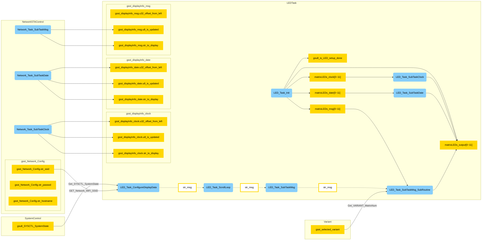

```mermaid
graph LR;
  classDef PARA fill:#7fffd4,stroke:#7fffd4,color:#000,stroke-width:4px;
  classDef VAR  fill:#ffd700,stroke:#ffd700,color:#000,stroke-width:4px;
  classDef ARG  fill:#fff,stroke:#ffd700,color:#000,stroke-width:4px;
  classDef FUNC fill:#87cefa,stroke:#87cefa,color:#000,stroke-width:4px;

  %% Variables
  subgraph LEDTask
    direction LR

      subgraph gsst_displayInfo_clock
        direction TB

        gsst_displayInfo_clock.u32_offset_from_left:::VAR;
        gsst_displayInfo_clock.u8_is_updated:::VAR;
        gsst_displayInfo_clock.str_to_display:::VAR;
      end

      subgraph gsst_displayInfo_date
        direction TB

        gsst_displayInfo_date.u32_offset_from_left:::VAR;
        gsst_displayInfo_date.u8_is_updated:::VAR;
        gsst_displayInfo_date.str_to_display:::VAR;
      end

      subgraph gsst_displayInfo_msg
        direction TB

        gsst_displayInfo_msg.u32_offset_from_left:::VAR;
        gsst_displayInfo_msg.u8_is_updated:::VAR;
        gsst_displayInfo_msg.str_to_display:::VAR;
      end

    gsu8_is_LED_setup_done:::VAR;
  end

  subgraph NetworkSTAControl
    direction LR

    subgraph gsst_Network_Config
      direction TB

      gsst_Network_Config.str_ssid:::VAR;
      gsst_Network_Config.str_passwd:::VAR;
      gsst_Network_Config.str_hostname:::VAR;
    end
  end

  subgraph SystemControl
    direction LR

    gsu8_SYSCTL_SystemState:::VAR;
  end

  subgraph Variant
    direction LR

    gsst_selected_variant:::VAR;
  end


  %% Functions  
  subgraph LEDTask
    direction LR

    LED_Task_Init(LED_Task_Init):::FUNC --> matrixLEDs_clock["matrixLEDs_clock[0~11]"]:::VAR;
    LED_Task_Init(LED_Task_Init):::FUNC --> matrixLEDs_date["matrixLEDs_date[0~11]"]:::VAR;
    LED_Task_Init(LED_Task_Init):::FUNC --> matrixLEDs_msg["matrixLEDs_msg[0~11]"]:::VAR;
    LED_Task_Init(LED_Task_Init):::FUNC --> matrixLEDs_output["matrixLEDs_output[0~11]"]:::VAR;
    LED_Task_Init(LED_Task_Init):::FUNC --> gsu8_is_LED_setup_done:::VAR;

    matrixLEDs_clock:::VAR --> LED_Task_SubTaskClock(LED_Task_SubTaskClock):::FUNC --> matrixLEDs_output;
    matrixLEDs_date:::VAR --> LED_Task_SubTaskDate(LED_Task_SubTaskDate):::FUNC --> matrixLEDs_output;
    matrixLEDs_msg:::VAR --> LED_Task_SubTaskMsg_SubRoutine(LED_Task_SubTaskMsg_SubRoutine):::FUNC --> matrixLEDs_output;

    gsu8_SYSCTL_SystemState -- Get_SYSCTL_SystemState --> LED_Task_ConfigureDisplayData(LED_Task_ConfigureDisplayData):::FUNC;
    gsst_Network_Config.str_ssid -- GET_Network_WiFi_SSID --> LED_Task_ConfigureDisplayData(LED_Task_ConfigureDisplayData):::FUNC;
    LED_Task_ConfigureDisplayData(LED_Task_ConfigureDisplayData):::FUNC .- LED_Task_ConfigureDisplayData.str_msg[str_msg]:::ARG .-> LED_Task_ScrollLoop(LED_Task_ScrollLoop):::FUNC;
    LED_Task_ScrollLoop(LED_Task_ScrollLoop):::FUNC .- LED_Task_ScrollLoop.str_msg[str_msg]:::ARG .-> LED_Task_SubTaskMsg(LED_Task_SubTaskMsg):::FUNC;
    LED_Task_SubTaskMsg(LED_Task_SubTaskMsg):::FUNC .- LED_Task_SubTaskMsg.str_msg[str_msg]:::ARG .-> LED_Task_SubTaskMsg_SubRoutine(LED_Task_SubTaskMsg_SubRoutine):::FUNC;
    gsst_selected_variant:::VAR -- Get_VARIANT_MatrixNum --> LED_Task_SubTaskMsg_SubRoutine(LED_Task_SubTaskMsg_SubRoutine):::FUNC;
  end
  
  subgraph NetworkSTAControl
    direction LR

    Network_Task_SubTaskClock(Network_Task_SubTaskClock):::FUNC --> gsst_displayInfo_clock.u32_offset_from_left:::VAR;
    Network_Task_SubTaskClock(Network_Task_SubTaskClock):::FUNC --> gsst_displayInfo_clock.u8_is_updated:::VAR;
    Network_Task_SubTaskClock(Network_Task_SubTaskClock):::FUNC --> gsst_displayInfo_clock.str_to_display:::VAR;

    Network_Task_SubTaskDate(Network_Task_SubTaskDate):::FUNC --> gsst_displayInfo_date.u32_offset_from_left:::VAR;
    Network_Task_SubTaskDate(Network_Task_SubTaskDate):::FUNC --> gsst_displayInfo_date.u8_is_updated:::VAR;
    Network_Task_SubTaskDate(Network_Task_SubTaskDate):::FUNC --> gsst_displayInfo_date.str_to_display:::VAR;

    Network_Task_SubTaskMsg(Network_Task_SubTaskMsg):::FUNC --> gsst_displayInfo_msg.str_to_display:::VAR;
    Network_Task_SubTaskMsg(Network_Task_SubTaskMsg):::FUNC --> gsst_displayInfo_msg.u8_is_updated:::VAR;
    
  end

```
