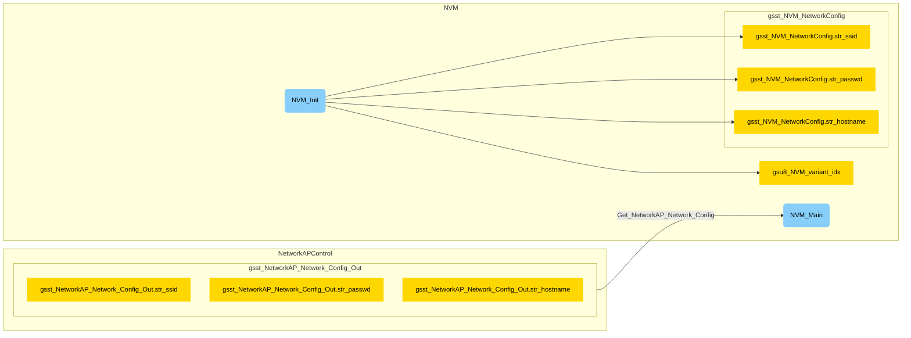

```mermaid
graph LR;
  classDef PARA fill:#7fffd4,stroke:#7fffd4,color:#000,stroke-width:4px;
  classDef VAR  fill:#ffd700,stroke:#ffd700,color:#000,stroke-width:4px;
  classDef ARG  fill:#fff,stroke:#ffd700,color:#000,stroke-width:4px;
  classDef FUNC fill:#87cefa,stroke:#87cefa,color:#000,stroke-width:4px;

  %% Variables
  subgraph NVM
    direction LR

    subgraph gsst_NVM_NetworkConfig
      direction TB
    
      gsst_NVM_NetworkConfig.str_ssid:::VAR;
      gsst_NVM_NetworkConfig.str_passwd:::VAR;
      gsst_NVM_NetworkConfig.str_hostname:::VAR;
    end

    gsu8_NVM_variant_idx:::VAR;
  end

  subgraph NetworkAPControl
    direction TB

    subgraph gsst_NetworkAP_Network_Config_Out
      direction TB
      gsst_NetworkAP_Network_Config_Out.str_ssid:::VAR;
      gsst_NetworkAP_Network_Config_Out.str_passwd:::VAR;
      gsst_NetworkAP_Network_Config_Out.str_hostname:::VAR;
    end
  end

  %% Functions

  subgraph NVM
    direction LR

    NVM_Init(NVM_Init):::FUNC --> gsst_NVM_NetworkConfig.str_ssid:::VAR;
    NVM_Init(NVM_Init):::FUNC --> gsst_NVM_NetworkConfig.str_passwd:::VAR;
    NVM_Init(NVM_Init):::FUNC --> gsst_NVM_NetworkConfig.str_hostname:::VAR;
    NVM_Init(NVM_Init):::FUNC --> gsu8_NVM_variant_idx:::VAR;

    gsst_NetworkAP_Network_Config_Out -- Get_NetworkAP_Network_Config --> NVM_Main(NVM_Main):::FUNC;
  end

  

```
