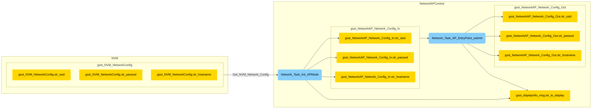

```mermaid
graph LR;
  classDef PARA fill:#7fffd4,stroke:#7fffd4,color:#000,stroke-width:4px;
  classDef VAR  fill:#ffd700,stroke:#ffd700,color:#000,stroke-width:4px;
  classDef ARG  fill:#fff,stroke:#ffd700,color:#000,stroke-width:4px;
  classDef FUNC fill:#87cefa,stroke:#87cefa,color:#000,stroke-width:4px;

  %% Variables
  subgraph NVM
    direction LR

    subgraph gsst_NVM_NetworkConfig
      direction TB
    
      gsst_NVM_NetworkConfig.str_ssid:::VAR;
      gsst_NVM_NetworkConfig.str_passwd:::VAR;
      gsst_NVM_NetworkConfig.str_hostname:::VAR;
    end
  end

  subgraph NetworkAPControl
    direction LR

    subgraph gsst_NetworkAP_Network_Config_In
      direction TB

      gsst_NetworkAP_Network_Config_In.str_ssid:::VAR;
      gsst_NetworkAP_Network_Config_In.str_passwd:::VAR;
      gsst_NetworkAP_Network_Config_In.str_hostname:::VAR;

    end

    subgraph gsst_NetworkAP_Network_Config_Out
      direction TB
      gsst_NetworkAP_Network_Config_Out.str_ssid:::VAR;
      gsst_NetworkAP_Network_Config_Out.str_passwd:::VAR;
      gsst_NetworkAP_Network_Config_Out.str_hostname:::VAR;
    end
  end


  %% Functions
  subgraph NetworkAPControl
    direction LR

    gsst_NVM_NetworkConfig -- Get_NVM_Network_Config --> Network_Task_Init_APMode(Network_Task_Init_APMode):::FUNC;
    
    Network_Task_Init_APMode(Network_Task_Init_APMode):::FUNC --> gsst_NetworkAP_Network_Config_In.str_ssid:::VAR;
    Network_Task_Init_APMode(Network_Task_Init_APMode):::FUNC --> gsst_NetworkAP_Network_Config_In.str_passwd:::VAR;
    Network_Task_Init_APMode(Network_Task_Init_APMode):::FUNC --> gsst_NetworkAP_Network_Config_In.str_hostname:::VAR;

    gsst_NetworkAP_Network_Config_In --> Network_Task_AP_EntryPoint_submit(Network_Task_AP_EntryPoint_submit):::FUNC;

    Network_Task_AP_EntryPoint_submit(Network_Task_AP_EntryPoint_submit):::FUNC --> gsst_NetworkAP_Network_Config_Out.str_ssid:::VAR;
    Network_Task_AP_EntryPoint_submit(Network_Task_AP_EntryPoint_submit):::FUNC --> gsst_NetworkAP_Network_Config_Out.str_passwd:::VAR;
    Network_Task_AP_EntryPoint_submit(Network_Task_AP_EntryPoint_submit):::FUNC --> gsst_NetworkAP_Network_Config_Out.str_hostname:::VAR;

    Network_Task_Init_APMode(Network_Task_Init_APMode):::FUNC --> gsst_displayInfo_msg.str_to_display:::VAR;
    Network_Task_AP_EntryPoint_submit(Network_Task_AP_EntryPoint_submit):::FUNC --> gsst_displayInfo_msg.str_to_display:::VAR

  end
  

```
