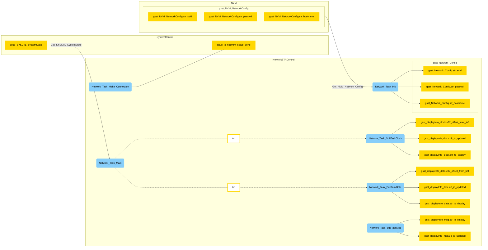

```mermaid
graph LR;
  classDef PARA fill:#7fffd4,stroke:#7fffd4,color:#000,stroke-width:4px;
  classDef VAR  fill:#ffd700,stroke:#ffd700,color:#000,stroke-width:4px;
  classDef ARG  fill:#fff,stroke:#ffd700,color:#000,stroke-width:4px;
  classDef FUNC fill:#87cefa,stroke:#87cefa,color:#000,stroke-width:4px;

  %% Variables
  subgraph NetworkSTAControl
    direction LR

    subgraph gsst_Network_Config
      direction TB

      gsst_Network_Config.str_ssid:::VAR;
      gsst_Network_Config.str_passwd:::VAR;
      gsst_Network_Config.str_hostname:::VAR;
    end
  end

  subgraph NVM
    direction LR

    subgraph gsst_NVM_NetworkConfig
      direction TB
    
      gsst_NVM_NetworkConfig.str_ssid:::VAR;
      gsst_NVM_NetworkConfig.str_passwd:::VAR;
      gsst_NVM_NetworkConfig.str_hostname:::VAR;
    end
  end

  subgraph SystemControl
    direction LR

    gsu8_is_network_setup_done:::VAR;
    gsu8_SYSCTL_SystemState:::VAR;
  end


  %% Functions
  subgraph NetworkSTAControl
    direction LR

    gsst_NVM_NetworkConfig -- Get_NVM_Network_Config --> Network_Task_Init(Network_Task_Init):::FUNC;

    Network_Task_Init(Network_Task_Init):::FUNC --> gsst_Network_Config.str_ssid:::VAR;
    Network_Task_Init(Network_Task_Init):::FUNC --> gsst_Network_Config.str_passwd:::VAR;
    Network_Task_Init(Network_Task_Init):::FUNC --> gsst_Network_Config.str_hostname:::VAR;

    gsu8_SYSCTL_SystemState -- Get_SYSCTL_SystemState --> Network_Task_Main(Network_Task_Main):::FUNC;
    Network_Task_Main(Network_Task_Main):::FUNC .- Network_Task_Main_a[tm]:::ARG .-> Network_Task_SubTaskClock(Network_Task_SubTaskClock):::FUNC;
    Network_Task_Main(Network_Task_Main):::FUNC .- Network_Task_Main_b[tm]:::ARG .-> Network_Task_SubTaskDate(Network_Task_SubTaskDate):::FUNC;
    Network_Task_Make_Connection(Network_Task_Make_Connection):::FUNC --> gsu8_is_network_setup_done:::VAR;

    Network_Task_SubTaskClock(Network_Task_SubTaskClock):::FUNC --> gsst_displayInfo_clock.u32_offset_from_left:::VAR;
    Network_Task_SubTaskClock(Network_Task_SubTaskClock):::FUNC --> gsst_displayInfo_clock.u8_is_updated:::VAR;
    Network_Task_SubTaskClock(Network_Task_SubTaskClock):::FUNC --> gsst_displayInfo_clock.str_to_display:::VAR;

    Network_Task_SubTaskDate(Network_Task_SubTaskDate):::FUNC --> gsst_displayInfo_date.u32_offset_from_left:::VAR;
    Network_Task_SubTaskDate(Network_Task_SubTaskDate):::FUNC --> gsst_displayInfo_date.u8_is_updated:::VAR;
    Network_Task_SubTaskDate(Network_Task_SubTaskDate):::FUNC --> gsst_displayInfo_date.str_to_display:::VAR;

    Network_Task_SubTaskMsg(Network_Task_SubTaskMsg):::FUNC --> gsst_displayInfo_msg.str_to_display:::VAR;
    Network_Task_SubTaskMsg(Network_Task_SubTaskMsg):::FUNC --> gsst_displayInfo_msg.u8_is_updated:::VAR;
    
  end

  

```
