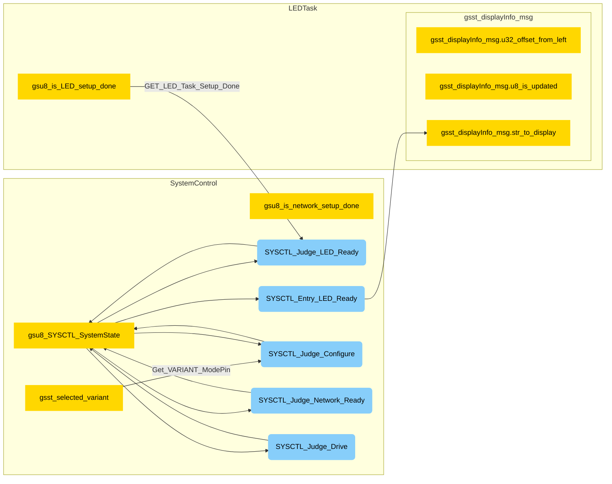

```mermaid
graph LR;
  classDef PARA fill:#7fffd4,stroke:#7fffd4,color:#000,stroke-width:4px;
  classDef VAR  fill:#ffd700,stroke:#ffd700,color:#000,stroke-width:4px;
  classDef ARG  fill:#fff,stroke:#ffd700,color:#000,stroke-width:4px;
  classDef FUNC fill:#87cefa,stroke:#87cefa,color:#000,stroke-width:4px;

  %% Variables
  subgraph SystemControl
    direction LR

    gsu8_is_network_setup_done:::VAR;
    gsu8_SYSCTL_SystemState:::VAR;
  end

  subgraph LEDTask
    direction LR

    gsu8_is_LED_setup_done:::VAR;
  end

  subgraph LEDTask
    direction LR

      subgraph gsst_displayInfo_msg
        direction TB

        gsst_displayInfo_msg.u32_offset_from_left:::VAR;
        gsst_displayInfo_msg.u8_is_updated:::VAR;
        gsst_displayInfo_msg.str_to_display:::VAR;
      end

    gsu8_is_LED_setup_done:::VAR;
  end


  %% Functions

  subgraph SystemControl
    direction LR

    gsu8_is_LED_setup_done:::VAR -- GET_LED_Task_Setup_Done --> SYSCTL_Judge_LED_Ready(SYSCTL_Judge_LED_Ready):::FUNC;
    gsu8_SYSCTL_SystemState:::VAR --> SYSCTL_Judge_LED_Ready(SYSCTL_Judge_LED_Ready):::FUNC;
    SYSCTL_Judge_LED_Ready(SYSCTL_Judge_LED_Ready):::FUNC --> gsu8_SYSCTL_SystemState:::VAR;
    gsu8_SYSCTL_SystemState:::VAR --> SYSCTL_Entry_LED_Ready(SYSCTL_Entry_LED_Ready):::FUNC;
    SYSCTL_Entry_LED_Ready(SYSCTL_Entry_LED_Ready):::FUNC --> gsst_displayInfo_msg.str_to_display:::VAR;

    gsst_selected_variant:::VAR -- Get_VARIANT_ModePin --> SYSCTL_Judge_Configure(SYSCTL_Judge_Configure):::FUNC;
    gsu8_SYSCTL_SystemState:::VAR --> SYSCTL_Judge_Configure(SYSCTL_Judge_Configure):::FUNC;
    SYSCTL_Judge_Configure(SYSCTL_Judge_Configure):::FUNC --> gsu8_SYSCTL_SystemState:::VAR;

    gsu8_SYSCTL_SystemState:::VAR --> SYSCTL_Judge_Network_Ready(SYSCTL_Judge_Network_Ready):::FUNC;
    SYSCTL_Judge_Network_Ready(SYSCTL_Judge_Network_Ready):::FUNC --> gsu8_SYSCTL_SystemState:::VAR;

    gsu8_SYSCTL_SystemState:::VAR --> SYSCTL_Judge_Drive(SYSCTL_Judge_Drive):::FUNC;
    SYSCTL_Judge_Drive(SYSCTL_Judge_Drive):::FUNC --> gsu8_SYSCTL_SystemState:::VAR;
  end
    

```
