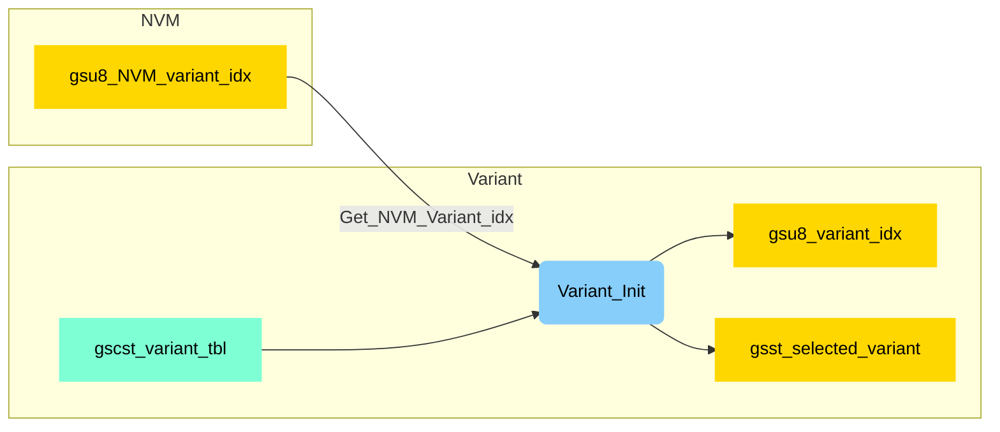

```mermaid
graph LR;
  classDef PARA fill:#7fffd4,stroke:#7fffd4,color:#000,stroke-width:4px;
  classDef VAR  fill:#ffd700,stroke:#ffd700,color:#000,stroke-width:4px;
  classDef ARG  fill:#fff,stroke:#ffd700,color:#000,stroke-width:4px;
  classDef FUNC fill:#87cefa,stroke:#87cefa,color:#000,stroke-width:4px;

  %% Variables
  subgraph Variant
    direction LR

    gscst_variant_tbl:::PARA;
    gsu8_variant_idx:::VAR;
    gsst_selected_variant:::VAR;
  end

  subgraph NVM
    direction LR

    gsu8_NVM_variant_idx:::VAR;
  end


  %% Functions

  subgraph Variant
    direction LR

    gsu8_NVM_variant_idx:::VAR -- Get_NVM_Variant_idx --> Variant_Init(Variant_Init):::FUNC --> gsu8_variant_idx:::VAR;
    gscst_variant_tbl:::PARA --> Variant_Init(Variant_Init):::FUNC --> gsst_selected_variant:::VAR;
  end

  

```
