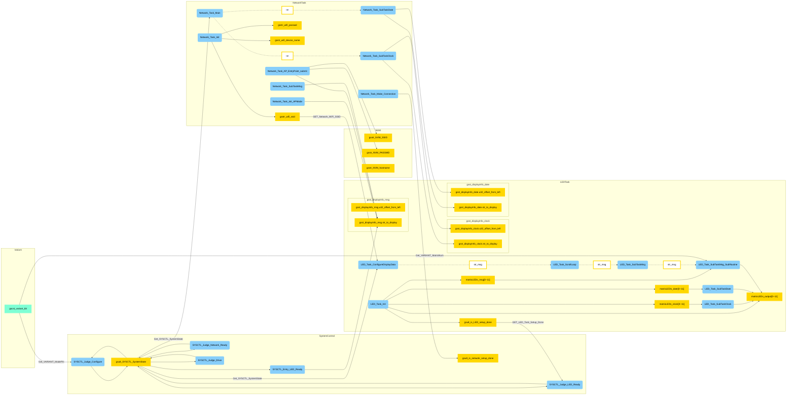

```mermaid
graph LR;
  classDef PARA fill:#7fffd4,stroke:#7fffd4,color:#000,stroke-width:4px;
  classDef VAR  fill:#ffd700,stroke:#ffd700,color:#000,stroke-width:4px;
  classDef ARG  fill:#fff,stroke:#ffd700,color:#000,stroke-width:4px;
  classDef FUNC fill:#87cefa,stroke:#87cefa,color:#000,stroke-width:4px;

  %% Variables
  subgraph Variant
    direction LR

    gscst_variant_tbl:::PARA;
  end

  subgraph SystemControl
    direction LR

    gsu8_is_network_setup_done:::VAR;
    gsu8_SYSCTL_SystemState:::VAR;
  end

  subgraph LEDTask
    direction LR

      subgraph gsst_displayInfo_clock
        direction TB

        gsst_displayInfo_clock.u32_offset_from_left:::VAR;
        gsst_displayInfo_clock.str_to_display:::VAR;
      end

      subgraph gsst_displayInfo_date
        direction TB

        gsst_displayInfo_date.u32_offset_from_left:::VAR;
        gsst_displayInfo_date.str_to_display:::VAR;
      end

      subgraph gsst_displayInfo_msg
        direction TB

        gsst_displayInfo_msg.u32_offset_from_left:::VAR;
        gsst_displayInfo_msg.str_to_display:::VAR;
      end

    gsu8_is_LED_setup_done:::VAR;
  end

  subgraph NVM
    direction LR

    gsstr_NVM_SSID:::VAR;
    gsstr_NVM_PASSWD:::VAR;
    gsstr_NVM_hostname:::VAR;
  end

  subgraph NetworkTask
    direction LR

    gsstr_wifi_ssid:::VAR;
    gsstr_wifi_passwd:::VAR;
    gsstr_wifi_device_name:::VAR;
  end


  %% Functions

  subgraph SystemControl
    direction LR

    gsu8_is_LED_setup_done:::VAR -- GET_LED_Task_Setup_Done --> SYSCTL_Judge_LED_Ready(SYSCTL_Judge_LED_Ready):::FUNC;
    gsu8_SYSCTL_SystemState:::VAR --> SYSCTL_Judge_LED_Ready(SYSCTL_Judge_LED_Ready):::FUNC;
    SYSCTL_Judge_LED_Ready(SYSCTL_Judge_LED_Ready):::FUNC --> gsu8_SYSCTL_SystemState:::VAR;
    gsu8_SYSCTL_SystemState:::VAR --> SYSCTL_Entry_LED_Ready(SYSCTL_Entry_LED_Ready):::FUNC;
    SYSCTL_Entry_LED_Ready(SYSCTL_Entry_LED_Ready):::FUNC --> gsst_displayInfo_msg.str_to_display:::VAR;

    gscst_variant_tbl:::PARA -- Get_VARIANT_ModePin --> SYSCTL_Judge_Configure(SYSCTL_Judge_Configure):::FUNC;
    gsu8_SYSCTL_SystemState:::VAR --> SYSCTL_Judge_Configure(SYSCTL_Judge_Configure):::FUNC;
    SYSCTL_Judge_Configure(SYSCTL_Judge_Configure):::FUNC --> gsu8_SYSCTL_SystemState:::VAR;

    gsu8_SYSCTL_SystemState:::VAR --> SYSCTL_Judge_Network_Ready(SYSCTL_Judge_Network_Ready):::FUNC;
    SYSCTL_Judge_Network_Ready(SYSCTL_Judge_Network_Ready):::FUNC --> gsu8_SYSCTL_SystemState:::VAR;

    gsu8_SYSCTL_SystemState:::VAR --> SYSCTL_Judge_Drive(SYSCTL_Judge_Drive):::FUNC;
    SYSCTL_Judge_Drive(SYSCTL_Judge_Drive):::FUNC --> gsu8_SYSCTL_SystemState:::VAR;
  end
  
  subgraph LEDTask
    direction LR

    LED_Task_Init(LED_Task_Init):::FUNC --> matrixLEDs_clock["matrixLEDs_clock[0~11]"]:::VAR;
    LED_Task_Init(LED_Task_Init):::FUNC --> matrixLEDs_date["matrixLEDs_date[0~11]"]:::VAR;
    LED_Task_Init(LED_Task_Init):::FUNC --> matrixLEDs_msg["matrixLEDs_msg[0~11]"]:::VAR;
    LED_Task_Init(LED_Task_Init):::FUNC --> matrixLEDs_output["matrixLEDs_output[0~11]"]:::VAR;
    LED_Task_Init(LED_Task_Init):::FUNC --> gsu8_is_LED_setup_done:::VAR;

    matrixLEDs_clock:::VAR --> LED_Task_SubTaskClock(LED_Task_SubTaskClock):::FUNC --> matrixLEDs_output;
    matrixLEDs_date:::VAR --> LED_Task_SubTaskDate(LED_Task_SubTaskDate):::FUNC --> matrixLEDs_output;
    matrixLEDs_msg:::VAR --> LED_Task_SubTaskMsg_SubRoutine(LED_Task_SubTaskMsg_SubRoutine):::FUNC --> matrixLEDs_output;

    gsu8_SYSCTL_SystemState -- Get_SYSCTL_SystemState --> LED_Task_ConfigureDisplayData(LED_Task_ConfigureDisplayData):::FUNC;
    gsstr_wifi_ssid -- GET_Network_WiFi_SSID --> LED_Task_ConfigureDisplayData(LED_Task_ConfigureDisplayData):::FUNC;
    LED_Task_ConfigureDisplayData(LED_Task_ConfigureDisplayData):::FUNC .- LED_Task_ConfigureDisplayData.str_msg[str_msg]:::ARG .-> LED_Task_ScrollLoop(LED_Task_ScrollLoop):::FUNC;
    LED_Task_ScrollLoop(LED_Task_ScrollLoop):::FUNC .- LED_Task_ScrollLoop.str_msg[str_msg]:::ARG .-> LED_Task_SubTaskMsg(LED_Task_SubTaskMsg):::FUNC;
    LED_Task_SubTaskMsg(LED_Task_SubTaskMsg):::FUNC .- LED_Task_SubTaskMsg.str_msg[str_msg]:::ARG .-> LED_Task_SubTaskMsg_SubRoutine(LED_Task_SubTaskMsg_SubRoutine):::FUNC;
    gscst_variant_tbl:::PARA -- Get_VARIANT_MatrixNum --> LED_Task_SubTaskMsg_SubRoutine(LED_Task_SubTaskMsg_SubRoutine):::FUNC;
  end

  subgraph NetworkTask
    direction LR

    Network_Task_Init(Network_Task_Init):::FUNC --> gsstr_wifi_ssid:::VAR;
    Network_Task_Init(Network_Task_Init):::FUNC --> gsstr_wifi_passwd:::VAR;
    Network_Task_Init(Network_Task_Init):::FUNC --> gsstr_wifi_device_name:::VAR;

    Network_Task_Init_APMode(Network_Task_Init_APMode):::FUNC --> gsst_displayInfo_msg.str_to_display:::VAR;
    Network_Task_AP_EntryPoint_submit(Network_Task_AP_EntryPoint_submit):::FUNC --> gsstr_NVM_SSID:::VAR;
    Network_Task_AP_EntryPoint_submit(Network_Task_AP_EntryPoint_submit):::FUNC --> gsstr_NVM_PASSWD:::VAR;
    Network_Task_AP_EntryPoint_submit(Network_Task_AP_EntryPoint_submit):::FUNC --> gsst_displayInfo_msg.str_to_display:::VAR

    gsu8_SYSCTL_SystemState -- Get_SYSCTL_SystemState --> Network_Task_Main(Network_Task_Main):::FUNC;
    Network_Task_Main(Network_Task_Main):::FUNC .- Network_Task_Main_a[tm]:::ARG .-> Network_Task_SubTaskClock(Network_Task_SubTaskClock):::FUNC;
    Network_Task_Main(Network_Task_Main):::FUNC .- Network_Task_Main_b[tm]:::ARG .-> Network_Task_SubTaskDate(Network_Task_SubTaskDate):::FUNC;
    Network_Task_Make_Connection(Network_Task_Make_Connection):::FUNC --> gsu8_is_network_setup_done:::VAR;

    Network_Task_SubTaskClock(Network_Task_SubTaskClock):::FUNC --> gsst_displayInfo_clock.u32_offset_from_left:::VAR;
    Network_Task_SubTaskClock(Network_Task_SubTaskClock):::FUNC --> gsst_displayInfo_clock.str_to_display:::VAR;
    Network_Task_SubTaskDate(Network_Task_SubTaskDate):::FUNC --> gsst_displayInfo_date.u32_offset_from_left:::VAR;
    Network_Task_SubTaskDate(Network_Task_SubTaskDate):::FUNC --> gsst_displayInfo_date.str_to_display:::VAR;
    Network_Task_SubTaskMsg(Network_Task_SubTaskMsg):::FUNC --> gsst_displayInfo_msg.str_to_display:::VAR;
    
  end

  

```
